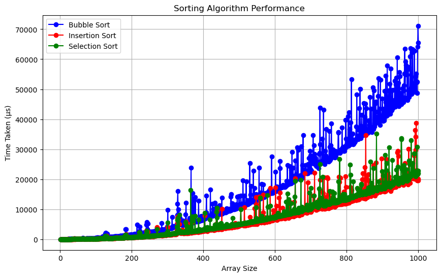

# 2248-CSE-5311-Hands-on-2
Below is a figure plotting the time it took for bubble, insertion and selection sort to sort arrays of sizes 0 to 1000, the time on the y axis is given in micro-seconds.

Selection sort is a simple algorithm that sorts an array by repeatedly finding the smallest element from the unsorted part and moving it to the beginning. Let’s break down why this method is correct:

1. Initial Step
Before the algorithm starts, the sorted portion of the array is empty. Since there’s nothing to compare, it’s trivially sorted.
2. Sorting Process
The algorithm looks at the entire array, finds the smallest element, and moves it to the start. Now, the first element is in its correct position.
The process repeats: in the remaining unsorted part of the array, it finds the next smallest element and moves it to the end of the sorted portion.
After each step, the sorted portion of the array grows by one element, and all these elements are in the correct order relative to each other.
3. Loop Invariant
After each iteration, the part of the array that has been sorted (up to the current position) contains the smallest elements in the correct order. This is our loop invariant—a condition that remains true at the start and end of each loop iteration.
4. Final Step
The algorithm continues this process until all elements are sorted. By the time the loop finishes, every element has been placed in the correct position in the sorted portion of the array.
5. Conclusion
Because the algorithm always ensures that the smallest elements are correctly placed in order from the start to the end of the array, we can be confident that when it finishes, the entire array is sorted. This step-by-step approach, where each element is placed in its correct position, guarantees that selection sort is a correct sorting algorithm.